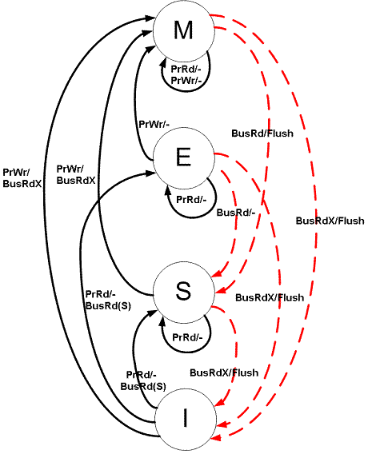

vlaser
====
####V*irtual* L*inear* A*ddress* SER*vice* - A Simulator for CC-NUMA Architecture

**NUMA** (Non-Uniform Memory Access) is distributed memory system that:
- Processors in the system all have their local memories
- All these local memories are spliced into an single address space
which can be accessed by all processors
- Processors and local memories are connected by a network,
speeds of accessing local memory and remote memory are different

For overcoming the low performance of accessing remote memory,
**caches** are placed between the processors and the memories.
That is so called **CC-NUMA** (Cache Coherent NUMA).

If uses **bus** as the inter-processor network,
NUMA system may like these:

When add with caches, the CC-NUMA system will like this:

For the case of using **writeback** cache, same addresses may be cached by
multiple processors, these processors will read and write these data
concurrently. So to ensure the correctness and integrity of the
data in the caches, **MESI** is used as the cache coherent protocol between
the processors.
 
**MESI** stands for the four status of cache blocks (cache lines):
+ **Modified**
+ **Exclusive**
+ **Shared**
+ **Invalid**
 
Cache status transitions are caused by local/remote read/write request,
and following diagram depicts these transitions:
 

For the diagram's details, please refer to
[MESI protocol on wikipedia](https://en.wikipedia.org/wiki/MESI_protocol)
 
For CC-NUMA architecture software simulation, it is more intuitive that
implement the inter-processor network by using **point-to-point** communications,
rather than by using **collision detection** or **collision avoidance**
based **bus** communications.
 
**vlaser** uses **point-to-point** communication. So original broadcast
operations which are for synchronizing cache status in MESI protocol will
be replaced by the procedure of sending cache status update request
to the remote processors one by one.

In order to achieve this, **vlaser** divides the local memories into
**memory blocks**, which have the same size as cache blocks (cache lines).
Local memory maintains one list for every memory block,
which are called as the **holder list**.
The holder lists record all the processors which are **holding** the memory
block in their caches, along with the **cache status**.
If a processor wants a memory block from a remote memory, it first send
a request to the remote memory, than the remote memory will send cache status
update messages to all the block's holder one by one according to the
**holder list**.

Following diagram shows a cache status transition caused by a remote block
write request:

In this diagram, processor 1 request a memory block that belongs to the
processor 2's local memory for writing. So the processor 2 is call as
**host** here. The **host** find that there are three processors holding
the block's copies in their caches: processor 2 itself, processor 3,
and processor 4. As the original request is a write request, the **host**
will send **set invalid** message to processor 3 and processor 4's memory,
than it set its own copy of the memory block as invalid too. Fortunately,
all the cache copies are **shared**, and no **writeback** is needed.
Finally, the **host** send the memory block and a confirmation message back to
the original requester (processor 1), processor 1 get this block and set
the block as **exclusive** in its cache.

**vlaser** is a distributed simulator, the system consists of a collection
of equally privileged processes, and each process simulate a CC-NUMA node
which contains cache and local memory. Each process has two threads:
+ **main thread** handles the read/write procedure of local processor,
initiates the requests to remote memories.
+ **service thread** is the background thread, it answers the requests
from remote processors.

One import thing is that, requests from remote processors are **queued** in
the **services thread**. New request will not be processed until the old
request's handling is completely finished, which means that all the relevant
cache statuses (local or remote) have been updated correctly and the
acknowledgement message has been sent back to the original requester.
This ensure the **sequential consistency** of the memory concurrent
accessing.

Users may use **vlaser** as a library, construct a **cpl** class (defined
in **cpl.h**), call **cpl::Initialize()** to setup the system, than call
**cpl::Read()** and **cpl::Write()** for random accessing the single memory
address space.

**vlaser** uses an abstract interface class **lsal** (defined in **lsal.h**)
to access the local memory. The actual implementation for the interface
is the class **lsal_fileemulate**, which uses local disk file as the local
memory. So the **vlaser** is actually working like a **cached distributed block
storage system**.

**vlaser**'s design work and implementation is accomplished at
**Institute of Scientific Computing, Nankai University** in Mar 2011.
**vlaser** is tested on the **NKStars** cluster.

 